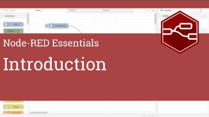
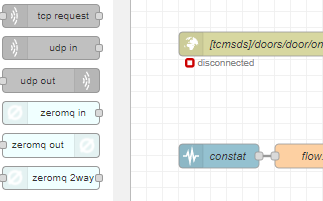
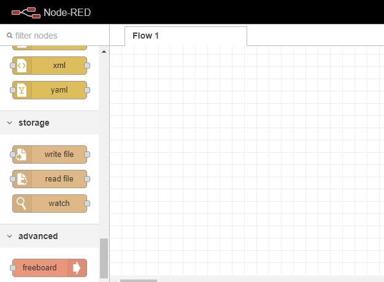
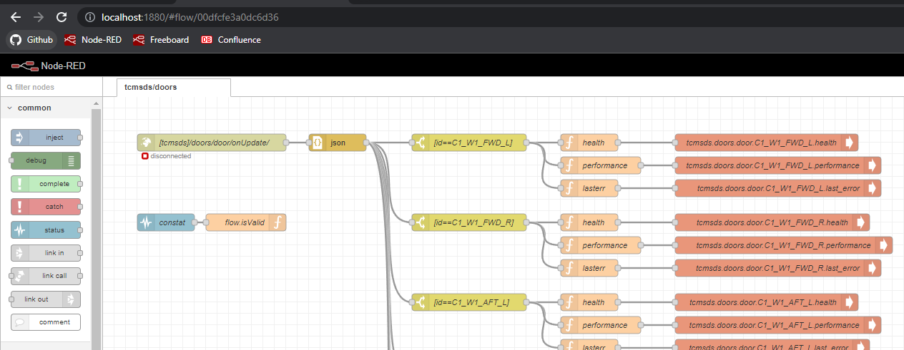
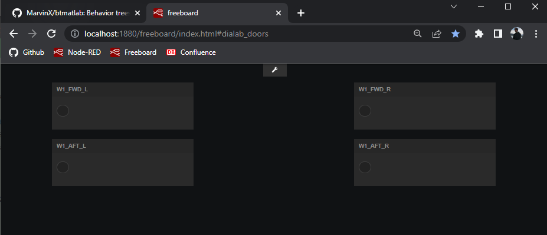

# Node-RED/Freeboard setup and usage

## Prerequisites

### For ZeroMQ support and ZeroMQ node for Node-RED installation

- Python37 installation; see also [Miniconda
    Setup](onenote:#Miniconda%20Setup&section-id={346189E6-8884-4EBD-A013-344879C06333}&page-id={57F0C775-5C0A-48A4-8B94-EF360AF53D82}&end&base-path=https://d.docs.live.net/0b28eef58eb676b1/Dokumente/Notizbuch%20von%20Kai/Howto.one)

- VS2017 Build Tools installation; see also [VS2019, VS2017, VS2015 Build
    Tools](onenote:#VS2019,%20VS2017,%20VS2015%20Build%20Tools&section-id={346189E6-8884-4EBD-A013-344879C06333}&page-id={E44E08A3-D0DC-4AD2-963A-C26DF371F3CA}&end&base-path=https://d.docs.live.net/0b28eef58eb676b1/Dokumente/Notizbuch%20von%20Kai/Howto.one)

    The above steps are neccess

### For cloning and building nodered-freeboard package from github.com/MarvinX

- Install VSCode and Git; see also [VSCode
    Setup](onenote:#VSCode%20Setup&section-id={346189E6-8884-4EBD-A013-344879C06333}&page-id={13903EC6-6CE7-42B1-85EC-72DFDBBB1960}&end&base-path=https://d.docs.live.net/0b28eef58eb676b1/Dokumente/Notizbuch%20von%20Kai/Howto.one)
    and [MinGit Setup for
    VSCode](onenote:#MinGit%20Setup%20for%20VSCode&section-id={346189E6-8884-4EBD-A013-344879C06333}&page-id={10ACCEB0-0DCA-4BD9-B324-1DAFAE044C9C}&end&base-path=https://d.docs.live.net/0b28eef58eb676b1/Dokumente/Notizbuch%20von%20Kai/Howto.one)

## Node.js download and installation

- See <https://nodered.org/docs/getting-started/windows>

- Use the above Quick Start guide to install Node.js and Node-RED

- TBD: Think about using
    [PM2](https://nodered.org/docs/faq/starting-node-red-on-boot) to start
    node-red service automatically on Win10 boot

### Install latest Node.js LTS version on Win10

- Download the MSI for **Node.js LTS 14.17.6** from <https://nodejs.org/en/>

- Run the MSI and install to C:\\nodejs\\ (requires Admin rights)

- Select standard Node.js options for packages to be installed

- Do not check "Automatically install the neccessary tools ..."

  - Use the following link to manually setup Python and VS C++ compiler
        support Node.js for compiling nodejs extension. For the following this
        should be, however, not neccessary.

    - See
        [https://github.com/nodejs/node-gyp\#on-windows](https://github.com/nodejs/node-gyp#on-windows)

- This will install the Node.js core and NPM package manager under
    C:\\nodejs\\node_modules and also add the Node.js binaries and script to the
    system path

### Install Node.js grunt/grunt-cli

- Open the Node.js command prompt (WinStart \> Search "Node.js Command
    prompt")

- In the Node.js command prompt enter the following commands

- The working directory should be your Windows %HOMEPATH% e.g. C:\\Users\\ksc

- \#\> npm install -g grunt

- This installs [grunt](https://gruntjs.com/) and and
    [grunt-cli](https://gruntjs.com/getting-started) to %HOMEPATH%\\node_modules

- This package is required to for local installation and setup of the
    Freeboard sources (see below)

## Node-RED installation

- Open the Node.js command prompt (WinStart \> Search "Node.js Command
    prompt")

- The working directory should be your Windows %HOMEPATH%, e.g. C:\\Users\\ksc

- \#\> npm install -g --unsafe-perm node-red

- This installs node-red under %HOMEPATH%\\node_modules and also adds the
    coresponding paths to node-red binaries and scripts to your user %PATH%

- On first node-red usage the \~/.node-red user directory will created, where
    user-local config scripts and setting will be maintained, as well as
    user-specific node-red addons, such as the node-red/

    freeboard addon (see below)

- This \~/.node-red user directory is neccessary for installing the
    node-red/freeboard addon, so we have to run node-red once after
    installation.

- In the open Node.js command prompt run ...

- \#\> node-red

- The output should look similar to the below screenshot

    

- Open a browser (Chrome is prefered) and type <http://localhost:1880/> which
    opens the node-red editor

    

- There is also this video tutorial on [Introduction - Node-RED
    Essentials](https://youtu.be/ksGeUD26Mw0)

    

## Install Node.js ZeroMQ support and ZeroMQ node for Node-RED

- Kill any open node-red processes

- Open a NodeJS console

- \#\> cd \~/.node-red

- npm install node-red-contrib-zeromq

- \#\> node-red

- Open a browser (Chrome is prefered) and type <http://localhost:1880/> which
    opens the node-red editor

- There should be 3 new zeromq nodes in the Node-RED/network nodes section as
    shown below

    

## Install nodered-freeboard package from github.com/MarvinX

### Cloning and installing from Github

- The
    [node-red/freeboard](https://flows.nodered.org/node/node-red-contrib-freeboard)
    addon adds a new type of datasource to Freeboard which allows to add one or
    more node-red flows to a Freeboard dashboard instance. See also
    <https://github.com/urbiworx/node-red-contrib-freeboard> for details about
    how node-red flows are integrated into Freeboard.

- The original node-red/freeboard extension had a couple of flaws and bugs and
    had to be slightly patched

- The patched node-red/freeboard extension is available at
    <https://github.com/MarvinX/nodered-freeboard.git>

- The following steps describe how to get and install the patched
    node-red/freeboard extension und Node-RED

- Kill any open node-red processes

- Open a NodeJS console

- \#\> md W:\\NodeJS

- \#\> cd W:\\NodeJS

- \#\> git clone <https://github.com/MarvinX/nodered-freeboard.git>

- \#\> cd nodered-freeboard

- \#\> npm install

    \--\> Fetches nodered-freeboard package dependencies such as freeboard and
    express framework

- \#\> npm run postinstall

    \--\> Run package.json/script/postinstall which call rewrite.js

    \--\> rewrite.js applies some patches to the original
    node_modules/freeboard/freeboard.js code

    \--\> also freeboard-widget-rag-files/ are copied to
    node_modules/freeboard/plugins/thirdparty/

- \#\> cd \~/.node-red

- \#\> npm install W:\\NodeJS\\nodered-freeboard  
    \--\> adds local the local nodered-freeboard package to
    \~/.node-red/node_modules/node-red-contrib-freeboard and updates
    \~/.node-red/package.json accordingly

### Uninstall Node-RED/freeboard package

- Kill any open node-red processes

- Open a NodeJS console

- \#\> cd \~/.node-red

- \#\> npm uninstall node-red-contrib-freeboard

### Test if Node-RED/freeboard extension has been properly installed

- Restart node-red

- \#\> Open a NodeJS console

- \#\> cd \~/.node-red

- \#\> node-red

- Open a browser (Chrome is prefered) and type <http://localhost:1880/> which
    opens the node-red editor

- Check Nodes/advanced section in Node-RED editor for a new node called
    "freeboard"

    

- Tip: Add a Node-RED bookmark for <http://localhost:1880/> to you browser
    menu bar

## Installing custom Node-RED flows to \~/.node-red

- For example, to install the Node-RED which drives the DiaLab VEC/Doors
    dashboard from
    [btmatlab](https://github.com/MarvinX/btmatlab)/util/nodered_freeboard/,
    just copy
    [btmatlab](https://github.com/MarvinX/btmatlab)/util/nodered_freeboard/nodered_flows.json
    to \~/.node-red/flows.json

- Note: \~/.node-red/flows.json should be backed up before updating it!

- Note: \~/.node-red/flows.json is the default Node-RED flows file, which is
    openend by Node-RED on loading or refreshing <http://localhost:1880/>

    

## Installing custom Freeboad dashboards to \~/.node-red

- For example, to install the Freeboard dashboard for the DiaLab VEC/Doors
    demo from
    [btmatlab](https://github.com/MarvinX/btmatlab)/util/nodered_freeboard/freeboard_dialab_doors.json,
    just copy
    [btmatlab](https://github.com/MarvinX/btmatlab)/util/nodered_freeboard/freeboard_dialab_doors.json
    to \~/.node-red/freeboard_dialab_doors.json

- Note: Make sure the Freeboard dashboard \*.json file name starts with
    "freeboard_" otherwise it won't be found

- The patched nodered-freeboard from github.com/MarvinX finds available
    freeboard dashboards in the \~/.node-red directory be searching for file
    starting with "freeboard_" and ending with \*.json

- The found freeboard dashboard files can be opened/used in the browser using
    the address pattern
    `http://localhost:1880/freeboard/index.html#\<dashboard-name\>`
    where \<dashboard name\> is the filename of the freeboard dashboard without
    the starting "freeboard_" prefix and without the trailing "\*.json"
    extension

- For example the freeboard dashboard file
    \~/.node-red/freeboard_dialab_doors.json can be opened in the browser using
    the following address
    [http://localhost:1880/freeboard/index.html\#dialab_doors](http://localhost:1880/freeboard/index.html#dialab_doors)

    

## Using the node-red/freeboard addon

- See <https://flows.nodered.org/node/node-red-contrib-freeboard> for the
    basic usage of the new freeboard node inside node-red and how to add
    node-red/freeboard flows as datasource in the freeboard dashboard

- Basic steps:

- Start node-red and open the node-red editor in your browser (see section
    [Install
    Node-RED](onenote:#Node-RED\Freeboard%20setup&section-id={346189E6-8884-4EBD-A013-344879C06333}&page-id={C05B3FBA-41BB-452A-9AB0-CB456B5F120E}&object-id={E91DA78E-35D4-069F-004E-1FA35D3A5943}&6D&base-path=https://d.docs.live.net/0b28eef58eb676b1/Dokumente/Notizbuch%20von%20Kai/Howto.one)
    for details)

- Create a simple flow using a single freeboard node (see the example from
    [this link](https://flows.nodered.org/node/node-red-contrib-freeboard))

- Deploy the flow under node-red

- Open another browser tab a open a blank Freeboard dashboard using the
    following URL  
    <http://localhost:1880/freeboard/index.html>

- Add the node-red/freeboard flow as new datasource as described in [this
    link](https://flows.nodered.org/node/node-red-contrib-freeboard)

- Add a Freeboard widget which uses node-red/freeboard data source; see [this
    link](https://flows.nodered.org/node/node-red-contrib-freeboard)

- Save the newly created dashoard as JSON file by clicking on the "SAVE
    FREEBOARD" link in the dashboard control pane and the clicking on either
    "[PRETTY]" or "[MINIFIED]"

    

- Use the following filename schema when saving the dashboard  
    freeboard_\<dashboard-name\>.json, e.g. "freeboard_dialab_doors.json"

- Save the dashboard JSON file in your \~/.node-red user path

- Therein, you can also find the deployed node-red flows as "flows.json" file

- A saved freeboard dashboard can be later loaded into the browser tab by
    using the following URL schema  
    <http://localhost:1880/freeboard/index.html> \#\<saved-dashboard-name\>

- For example if the save dashboad JSON file is
    "\~/.node-red/freeboard_dialab_doors.json", then use

    [http://localhost:1880/freeboard/index.html\#dialab_doors](http://localhost:1880/freeboard/index.html#dialab_doors)

## Debugging the node-red/freeboard addon code

### Using VSCode

- <https://it.knightnet.org.uk/kb/nr-qa/vscode-debugger/>

### Using Chrome

- In Chrome browser open the node-red hosted freeboard dashboard you want to
    debug

- Use either the URL of the default (blank) Freeboard page
    <http://localhost:1880/freeboard/index.html>, or use
    <http://localhost:1880/freeboard/index.html> \#\<saved-dashboard-name\>,
    e.g.
    [http://localhost:1880/freeboard/index.html\#dialab_doors](http://localhost:1880/freeboard/index.html#dialab_doors)

- After the freeboard dashboard page has been loaded open, the Chrome debugger
    (developer tools) via CTRL+SHIFT+I

- In the Chrome debugger panel click in the "Sources" tab and open the
    freeboard_api/datasources page as shown in the below picture

- Set breakpoints in the freeboard JS script sections

- Run the Freeboard

    
