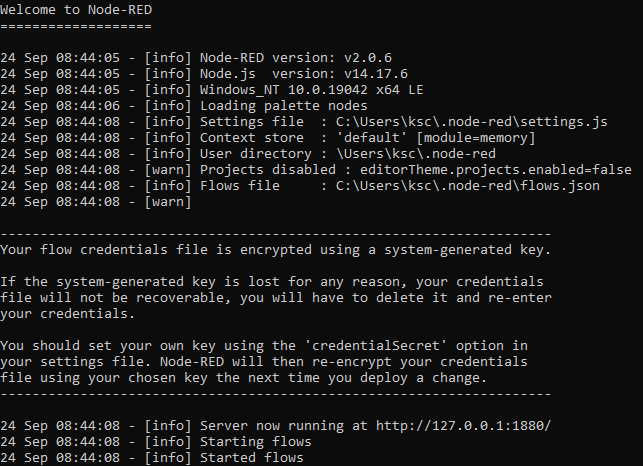
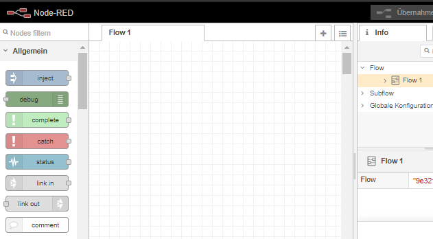
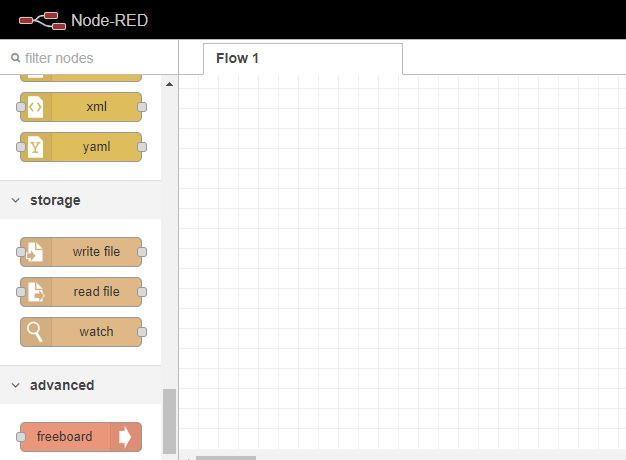
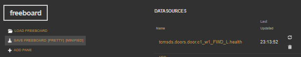
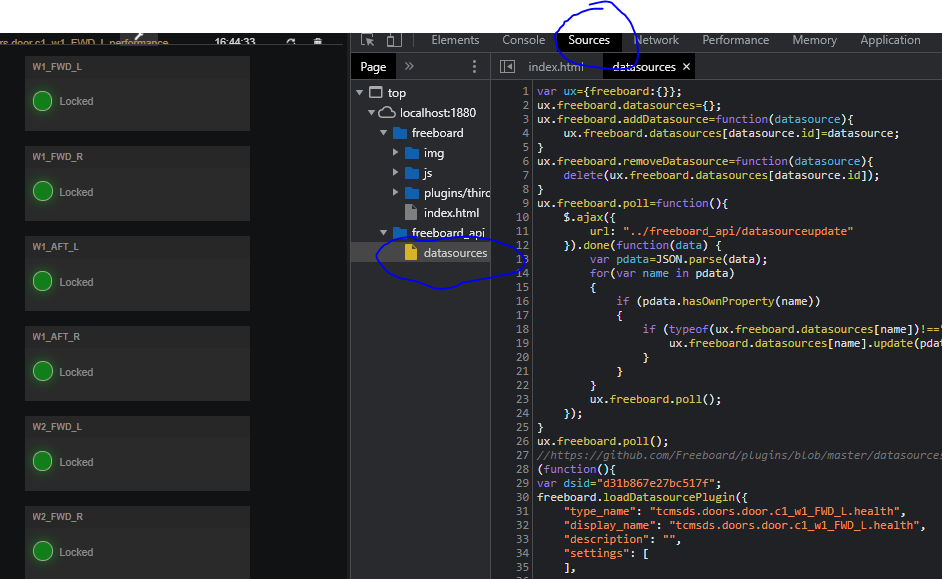

# NodeRED with Freeboard support

## Overview

This howto describes the steps for setting up [NodeRED](https://nodered.org/) under Win10 and adding the here provided [nodered-freeboard](../README.md) extension for [Freeboard](https://freeboard.io/) based dashboarding.

The original extension [node-red-contrib-freeboard](https://flows.nodered.org/node/node-red-contrib-freeboard) extension adds a new type of datasource to [Freeboard](https://freeboard.io/) dashboards which allows to drive Freeboard dashboards using NodeRED flows. See <https://github.com/urbiworx/node-red-contrib-freeboard> for details about how the NodeRED/Freeboard integration is realized.

The original extension has a couple of flaws and bugs and had to be slightly patched to work as expected.

## Prerequisites

### Install Node.js on Win10

- Download the MSI for latest Node.js LTS from <https://nodejs.org/en/>, e.g. LTS 14.17.6
- Run the MSI and install to `C:\nodejs` (requires Admin rights)
  - Use the default installation options for Node.js core packages
- Do not check "Automatically install the neccessary tools ..."
  - If needed, use the following link to manually setup Python and VS C++ compiler for building Node.js extensions; see also [nodejs/node-gyp/on-windows](https://github.com/nodejs/node-gyp#on-windows)
- Start the installation. This will install the Node.js core and NPM package manager under `C:\nodejs\` and also adds Node.js core and NPM binaries to the system path

### Install grunt and grunt-cli packages

- Open the Node.js console (WinStart \> Search "Node.js Command prompt")
  - The working directory should be your home dir `~/` (i.e. Windows %HOMEPATH%)
- On the Node.js command prompt run
  - `#> npm install -g grunt`
- This installs [grunt](https://gruntjs.com/) and
    [grunt-cli](https://gruntjs.com/getting-started) under `%APPDATA%/node_modules`

### Install NodeRED

- Open the Node.js console (WinStart \> Search "Node.js Command prompt")
  - The working directory should be your home dir `~/` (i.e. Windows %HOMEPATH%)
- On the Node.js command prompt run
  - `#> npm install -g --unsafe-perm node-red`
  - This installs NodeRED under `%APPDATA%/node_modules` and adds NodeRED to the user path
- On the Node.js command prompt run
  - `#> node-red`
  - On first run, the `~/.node-red` folder will be created, where user-specific NodeRED settings and extensions will be maintained
  
  

- Open a browser (Chrome is prefered) and type <http://localhost:1880/> which opens the NodeRED flow editor

    

- Tip: Add a NodeRED bookmark for <http://localhost:1880/> to your browser

## Build and install the nodered-freeboard extension

- Close all open NodeRED sessions (close browser and kill console process)
- Open the Node.js console (WinStart \> Search "Node.js Command prompt")
  - The working directory should be your home dir `~/` (i.e. Windows %HOMEPATH%)
- In Node.js console run
  - `#> md C:\Temp`
  - `#> cd C:\Temp`
  - `#> git clone https://github.com/MarvinX/nodered-freeboard.git`
  - `#> cd nodered-freeboard`
  - `#> npm install`
    - This fetches nodered-freeboard dependencies, such as `freeboard` and `express` package, and installs these dependencies under `C:\Temp\nodered-freeboard\node_modules`
  - `#> npm run postinstall`
    - Runs `../nodered-freeboard/package.json/script/postinstall` which calls ../`nodered-freeboard/rewritefiles.js` which in turn applies some patches to the original
  `../nodered-freeboard/node_modules/freeboard/freeboard.js` module
    - This also copies `../nodered-freeboard/freeboard-widget-rag-files/` to `nodered-freeboard/node_modules/freeboard/plugins/thirdparty/`
  - `#> cd ~/.node-red`
  - `#> npm install C:\Temp\nodered-freeboard`
    - This adds the locally built nodered-freeboard package to `~/.node-red/node_modules/node-red-contrib-freeboard` and updates `~/.node-red/package.json` accordingly
- After installing the locally built nodered-freeboard package to `~/.node-red/node_modules/node-red-contrib-freeboard`, the build folder `C:\Temp\nodered-freeboard\` can be deleted

## Perform a smoketest

- Restart NodeRED
  - Close all open NodeRED sessions (close browser and kill console process)
  - Open the Node.js console (WinStart \> Search "Node.js Command prompt")
  - The working directory should be your home dir `~/` (i.e. Windows %HOMEPATH%)
  - In Node.js console run
    - `#> cd ~/.node-red`
    - `#> node-red`
- Open a browser (Chrome is prefered) and type <http://localhost:1880/> which opens the NodeRED flow editor
- There should be an additional Freeboard node in NodeRED/advanced section

    

## Uninstalling the nodered-freeboard extension

- In case you dont't need the nodered-freeboard extension anymore ...
- Close all open NodeRED sessions (close browser and kill console process)
- Open the Node.js console (WinStart \> Search "Node.js Command prompt")
  - The working directory should be your home dir `~/` (i.e. Windows %HOMEPATH%)
- In Node.js console run
  - `#> cd ~/.node-red`
  - `#> npm uninstall node-red-contrib-freeboard`

## Creating a new NodeRED/Freeboard dashboard

- See also <https://flows.nodered.org/node/node-red-contrib-freeboard> for using the nodered-freeboard package and provided NodeRED/Freeboard node as datasource(s) driving a Freeboard dashboard

### Basic steps

- Start NodeRED and open the flow editor
- Create a new NodeRED flow using a single NodeRED/Freeboard node
  - See [this example](https://flows.nodered.org/node/node-red-contrib-freeboard) for details
- Deploy the new flow to NodeRED
  - Deploying a new flow is actually adding the flow to `~/.node-red/flow.json` and activating it in NodeRED process
- Open a new browser tab and enter <http://localhost:1880/freeboard/index.html>
- Add the deployed NodeRED/Freeboard flow as Freeboard datasource
  - See [this example](https://flows.nodered.org/node/node-red-contrib-freeboard) for details
- Add a new Freeboard widget which used the NodeRED/Freeboard flow as datasource
  - See [this example](https://flows.nodered.org/node/node-red-contrib-freeboard) for details
- Save the Freeboard dashoard as JSON file by clicking on the "SAVE FREEBOARD" link in the dashboard control panel and using either the "[PRETTY]" or "[MINIFIED]" option

    

- Use the following filename pattern when saving the dashboard
  - `freeboard_<dashboard-name>.json`, e.g. `freeboard_dialab_doors.json`
- Save the Freeboard *.json under `~/.node-red` (where `~/` denotes the Windows %HOMEPATH%)

- The new Freeboard dashboard can be now opened in the browser by using the following address pattern `http://localhost:1880/freeboard/index.html#<dashboard-name>`
- For example, if the Freeboard *.json is `~/.node-red/freeboard_dialab_doors.json`, then the corresponding address will be <http://localhost:1880/freeboard/index.html#dialab_doors>

## Debugging the nodered-freeboard extension

### Using VSCode

- See blog post <https://it.knightnet.org.uk/kb/nr-qa/vscode-debugger/>

### Using Chrome browser

- In Chrome browser open the Freeboard dashboard you want to debug
- Use either the address of the default (blank) Freeboard, which is <http://localhost:1880/freeboard/index.html>, or open a project-specific dashboard e.g. <http://localhost:1880/freeboard/index.html#dialab_doors>
- After the dashboard has been loaded, open the Chrome debugger via `CTRL+SHIFT+I`
- In the debugger panel click on the "Sources" tab and open the `freeboard_api/datasources` page which is shown below
- Set breakpoints in the JS script sections as needed
- Run the Freeboard code in the Chrome debugger

    
