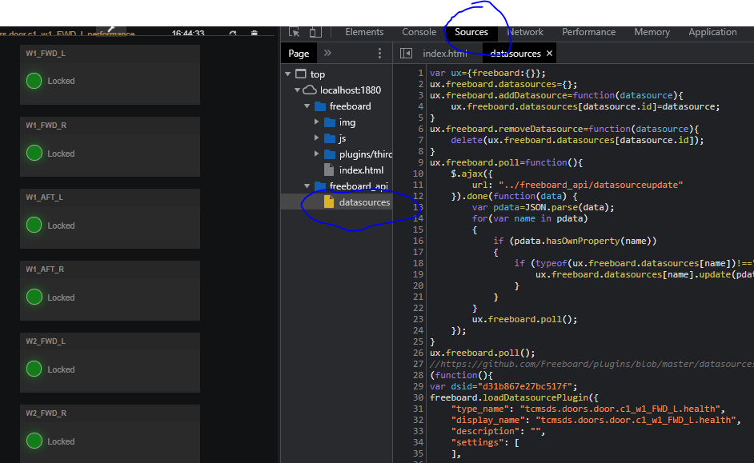

# Node-RED/Freeboard setup and usage

## Download and installation

-   See <https://nodered.org/docs/getting-started/windows>

-   Use the above Quick Start guide to install Node.js and Node-RED

-   TBD: Think about using
    [PM2](https://nodered.org/docs/faq/starting-node-red-on-boot) to start
    node-red service automatically on Win10 boot

### Install latest Node.js LTS version on Win10

-   Download the MSI for **Node.js LTS 14.17.6** from <https://nodejs.org/en/>

-   Run the MSI and install to C:\\nodejs\\ (requires Admin rights)

-   Select standard Node.js options for packages to be installed

-   Do not check "Automatically install the neccessary tools ..."

    -   Use the following link to manually setup Python and VS C++ compiler
        support Node.js for compiling nodejs extension. For the following this
        should be, however, not neccessary.

    -   See
        [https://github.com/nodejs/node-gyp\#on-windows](https://github.com/nodejs/node-gyp#on-windows)

-   This will install the Node.js core and NPM package manager under
    C:\\nodejs\\node_modules and also add the Node.js binaries and script to the
    system path

### Install Node.js grunt/grunt-cli

-   Open the Node.js command prompt (WinStart \> Search "Node.js Command
    prompt")

-   In the Node.js command prompt enter the following commands

-   The working directory should be your Windows %HOMEPATH% e.g. C:\\Users\\ksc

    ```cmd
    # npm install grunt
    # npm install grunt-cli
    ```

-   This installs [grunt](https://gruntjs.com/) and and
    [grunt-cli](https://gruntjs.com/getting-started) to %HOMEPATH%\\node_modules

-   This package is required to for local installation and setup of the
    Freeboard sources (see below)

### Install Node-RED

-   Open the Node.js command prompt (WinStart \> Search "Node.js Command
    prompt")

-   The working directory should be your Windows %HOMEPATH% e.g. C:\\Users\\ksc
    ```cmd
    # npm install -g --unsafe-perm node-red
    ```

-   This installs node-red under %HOMEPATH%\\node_modules and also adds the
    coresponding paths to node-red binaries and scripts to your user %PATH%

-   On first node-red usage the \~/.node-red user directory will created, where
    user-local config scripts and setting will be maintained, as well as
    user-specific node-red addons, such as the node-red/

    freeboard addon (see below)

-   This \~/.node-red user directory is neccessary for installing the
    node-red/freeboard addon, so we have to run node-red once after
    installation.

-   In the open Node.js command prompt run ...
    ```cmd
    # node-red
    ```

-   The output should look similar to the below screenshot

    

-   Open a browser (Chrome is prefered) and type <http://localhost:1880/> which
    opens the node-red editor

    

-   There is also this video tutorial on [Introduction - Node-RED
    Essentials](https://youtu.be/ksGeUD26Mw0)

    

### Install Freeboard

-   The self-hosed [Freeboard](https://freeboard.io/) dashboard version is
    opensource

-   Freeboard as to be cloned from
    [Github](https://github.com/Freeboard/freeboard) and installed locally using
    npm

-   The node-red/freeboard addon (see below) claims to automatically install
    Freeboard if neccessary. However, on my workstation this has been actually
    failed multiple time, and seems to be a [known
    issue](https://github.com/urbiworx/node-red-contrib-freeboard/issues/22).

-   The workaround is to install Freeboard *before* the node-red/freboard addon
    under \~/.node-red

-   Open the Node.js command prompt (WinStart \> Search "Node.js Command
    prompt")
    ```cmd
    # cd ~/.node-red (where ~ denotes your %HOMEPATH%)
    # git clone https://github.com/Freeboard/freeboard.git
    # npm install freeboard
    ```

### Install Node-RED/freeboard extension

-   The
    [node-red/freeboard](https://flows.nodered.org/node/node-red-contrib-freeboard)
    addon adds a new type of datasource to Freeboard which allows to add one or
    more node-red flows to a Freeboard dashboard instance. See also
    <https://github.com/urbiworx/node-red-contrib-freeboard> for details about
    how node-red flows are integrated into Freeboard.

-   Make sure you have installed Freeboard as described in the last section

-   Open the Node.js command prompt (WinStart \> Search "Node.js Command
    prompt")

    ```cmd
    # cd ~/.node-red (where ~ denotes your %HOMEPATH%)
    # npm install freeboard
    # npm install node-red-contrib-freeboard (will take some minutes)
    ```

-   For the used Node.js LTS 14.6.7 and node-red-contrib-freeboard-0.0.7, which
    have been used for this tutorial, you have to manually apply the following
    patch in order to get rid of using a deprected Express.js function in
    node-red-contrib-freeboard-0.0.7 and to fix the polling for node-red flow
    updates in the running Freeboard dashboard instance.

    ```diff
    Left base folder: C:\Temp\node-red-contrib-freeboard
    Right base folder: C:\Users\ksc\.node-red\node_modules\node-red-contrib-freeboard
    --- datasource.jsheader	2021-10-03 22:24:18.000000000 +0200
    +++ datasource.jsheader	2021-09-23 23:23:53.000000000 +0200
    @@ -5,13 +5,14 @@
    }
    ux.freeboard.removeDatasource=function(datasource){
        delete(ux.freeboard.datasources[datasource.id]);
    }
    ux.freeboard.poll=function(){
        $.ajax({
    -		url: "../freeboard_api/datasourceupdate"
    +		// url: "../freeboard_api/datasourceupdate"
    +		url: "../freeboard_api/datasourceupdate?direct=true"
        }).done(function(data) {
            var pdata=JSON.parse(data);
            for(var name in pdata)
            {
                if (pdata.hasOwnProperty(name))
                {
    --- datasource.template	2021-10-03 22:24:18.000000000 +0200
    +++ datasource.template	2021-09-24 00:28:08.000000000 +0200
    @@ -23,19 +23,21 @@
        }
        self.onSettingsChanged = function(newSettings) {
            currentSettings = newSettings;
        }
        self.updateNow = function() {
            $.ajax({
    -			url: "../freeboard_api/datasourceupdate?direct=true"
    +			url: "../freeboard_api/datasourceupdate",
    +            type: "GET",
    +            data: {direct:true}
            }).done(function(data) {
                var pdata=JSON.parse(data);
                if (typeof(pdata[dsid])!=="undefined"){
                    updateCallback(pdata[dsid]);
                }
            });
        }
        self.onDispose = function() {
            ux.freeboard.removeDatasource(self);
        }
    }
    })();
    --- freeboard.js	2021-10-03 22:24:18.000000000 +0200
    +++ freeboard.js	2021-09-24 00:40:13.000000000 +0200
    @@ -68,13 +68,13 @@
            var resp=pendingresponses;
            pendingresponses=new Array();
            for (var i in resp){
                resp[i].end(JSON.stringify({}));
            }
        }
    -	setInterval(interval,60000);
    +	setInterval(interval,1000);
    
    
        RED.httpNode.use(bodyParser.urlencoded({
            extended: true
        }));
        RED.httpNode.use("/freeboard",express.static(__dirname + '/node_modules/freeboard'));
    @@ -95,13 +95,14 @@
                });
    
            }
        );
        RED.httpNode.get("/freeboard_api/datasourceupdate",
            function (req,res){
    -			if(req.param("direct",false)){
    +			// if(req.param("direct",false)){
    +			if(req.query.direct){
                    var ret={};
                    for (var i in nodes){
                        ret[nodes[i].id]=nodes[i].lastValue;
                    }
                    res.end(JSON.stringify(ret));
                } else {
    ```

## Testing and using the node-red/freeboard addon 

-   See <https://flows.nodered.org/node/node-red-contrib-freeboard> for the
    basic usage of the new freeboard node inside node-red and how to add
    node-red/freeboard flows as datasource in the freeboard dashboard

-   Basic steps:

-   Start node-red and open the node-red editor in your browser (see section
    [Install
    Node-RED](onenote:#Node-RED\Freeboard%20setup&section-id={346189E6-8884-4EBD-A013-344879C06333}&page-id={C05B3FBA-41BB-452A-9AB0-CB456B5F120E}&object-id={E91DA78E-35D4-069F-004E-1FA35D3A5943}&6D&base-path=https://d.docs.live.net/0b28eef58eb676b1/Dokumente/Notizbuch%20von%20Kai/Howto.one)
    for details)

-   Create a simple fow using a single freeboard node (see the example from
    [this link](https://flows.nodered.org/node/node-red-contrib-freeboard))

-   Deploy the flow under node-red

-   Open another browser tab a open a blank Freeboard dashboard using the
    following URL  
    <http://localhost:1880/freeboard/index.html>

-   Add the node-red/freeboard flow as new datasource as described in [this
    link](https://flows.nodered.org/node/node-red-contrib-freeboard)

-   Add a Freeboard widget which uses node-red/freeboard data source; see [this
    link](https://flows.nodered.org/node/node-red-contrib-freeboard)

-   Save the newly created dashoard as JSON file by clicking on the "SAVE
    FREEBOARD" link in the dashboard control pane and the clicking on either
    "[PRETTY]" or "[MINIFIED]"

    

-   Use the following filename schema when saving the dashboard  
    freeboard_\<dashboard-name\>.json, e.g. "freeboard_dialab_doors.json"

-   Save the dashboard JSON file in your \~/.node-red user path

-   Therein, you can also find the deployed node-red flows as "flows.json" file

-   A saved freeboard dashboard can be later loaded into the browser tab by
    using the following URL schema  
    <http://localhost:1880/freeboard/index.html> \#\<saved-dashboard-name\>

-   For example if the save dashboad JSON file is
    "\~/.node-red/freeboard_dialab_doors.json", then use

    [http://localhost:1880/freeboard/index.html\#dialab_doors](http://localhost:1880/freeboard/index.html#dialab_doors)

## Debugging the node-red/freeboard addon code 

### Using VSCode (for server-side code)

-   https://it.knightnet.org.uk/kb/nr-qa/vscode-debugger/

### Using Chrome (for client-side code)

-   In Chrome browser open the node-red hosted freeboard dashboard you want to
    debug

-   Use either the URL of the default (blank) Freeboard page
    <http://localhost:1880/freeboard/index.html>, or use
    <http://localhost:1880/freeboard/index.html> \#\<saved-dashboard-name\>,
    e.g.
    [http://localhost:1880/freeboard/index.html\#dialab_doors](http://localhost:1880/freeboard/index.html#dialab_doors)

-   After the freeboard dashboard page has been loaded open, the Chrome debugger
    (developer tools) via CTRL+SHIFT+I

-   In the Chrome debugger panel click in the "Sources" tab and open the
    freeboard_api/datasources page as shown in the below picture
    
    

-   Set breakpoints in the freeboard JS script sections

-   Run the Freeboard
